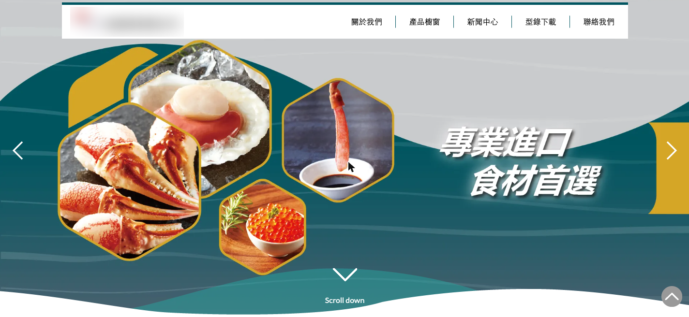
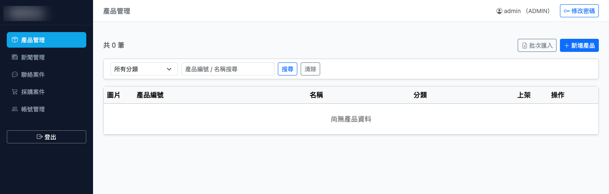

## 問題背景

客戶的官網為純靜態架構，任何內容更新都需要人工介入——新增一件產品、修改一則新聞公告、調整聯絡資訊，都得委託工程師直接改 HTML 檔案，再推回主機部署。

更棘手的是，官網沒有英文版本，面對海外採購商時只能提供中文頁面。客戶想改善這個情況，但逐篇手動翻譯幾百項產品資料，工作量大到不現實。

## 解決方案

重建為 Laravel 11（PHP 8.2）動態網站，核心是一套後台 CMS：

- **產品管理**：新增、編輯、下架個別產品；支援 Excel + ZIP 圖片批次匯入，依產品編號判斷新增或更新
- **新聞管理**：使用富文字編輯器撰寫中文內容，儲存時自動翻譯為英文
- **詢問單管理**：聯絡我們與商業採購表單自動建立案件、寄送通知信，後台可追蹤處理狀態
- **雙語切換**：前台訪客可切換中英文，英文內容由翻譯 API 於後台儲存時生成，前台讀取已儲存欄位，速度不受影響

*重建後的官網首頁（客戶識別資訊已模糊處理）。前台完整保留客戶原有的視覺設計，動態內容改由後台 CMS 驅動。*

*後台 CMS 的產品管理介面：左側為五大模組（產品、新聞、聯絡案件、採購案件、帳號），支援分類篩選、關鍵字搜尋與 Excel 批次匯入。（客戶識別資訊已模糊處理）*

## 我的角色與做法

- **單人交付整包**：需求訪談、架構與資料庫設計、前後台開發、部署與交付手冊，全程一人完成——客戶的對口從頭到尾只有我。
- **對接非技術客戶**：功能取捨不談技術名詞，談維護成本與風險——「這個做法你們以後自己能不能改」是每個決策的第一個問題。
- **交付即移交**：後台分 ADMIN／EDITOR 權限、附操作手冊，上線後客戶自行營運，不產生對工程師的長期依賴。

## 技術決策

核心抉擇是選 SaaS CMS 還是自建。WordPress、Strapi 等方案部署在客戶 Linux 主機維護成本高，且現有前台是從鏡像抓取的 HTML/CSS，換框架意味著重新切版。選擇自建後台，讓前台設計不動，只把動態資料改為 REST API 驅動，視覺風險最低。

後台採 Blade SSR + PRG Pattern，確保表單不會重複送出。公開端點走 REST API，前台 JavaScript `fetch` 載入動態內容。認證採 Laravel session 機制，分 ADMIN（全功能）和 EDITOR（帳號管理除外）兩個角色。

Google Cloud Translation API 接在儲存時觸發：編輯只填中文，翻譯在後台完成並存入資料庫。前台讀取時直接取已翻譯欄位，無即時 API 呼叫，前台效能不受影響。

## 挑戰與踩坑

最複雜的部分是 Excel 批次匯入的部分成功機制。客戶的產品目錄有幾百項，批次匯入時難免有部分列格式有誤。若整批失敗要求全部重傳，使用者體驗很差；若靜默跳過失敗列，客戶可能不知道哪些沒有匯入。

最終設計為：成功列正常寫入，失敗列收集後在結果頁顯示行號與失敗原因，讓客戶清楚知道哪幾列需要修正後重傳。這讓部分成功成為預期行為，而不是例外狀況。
