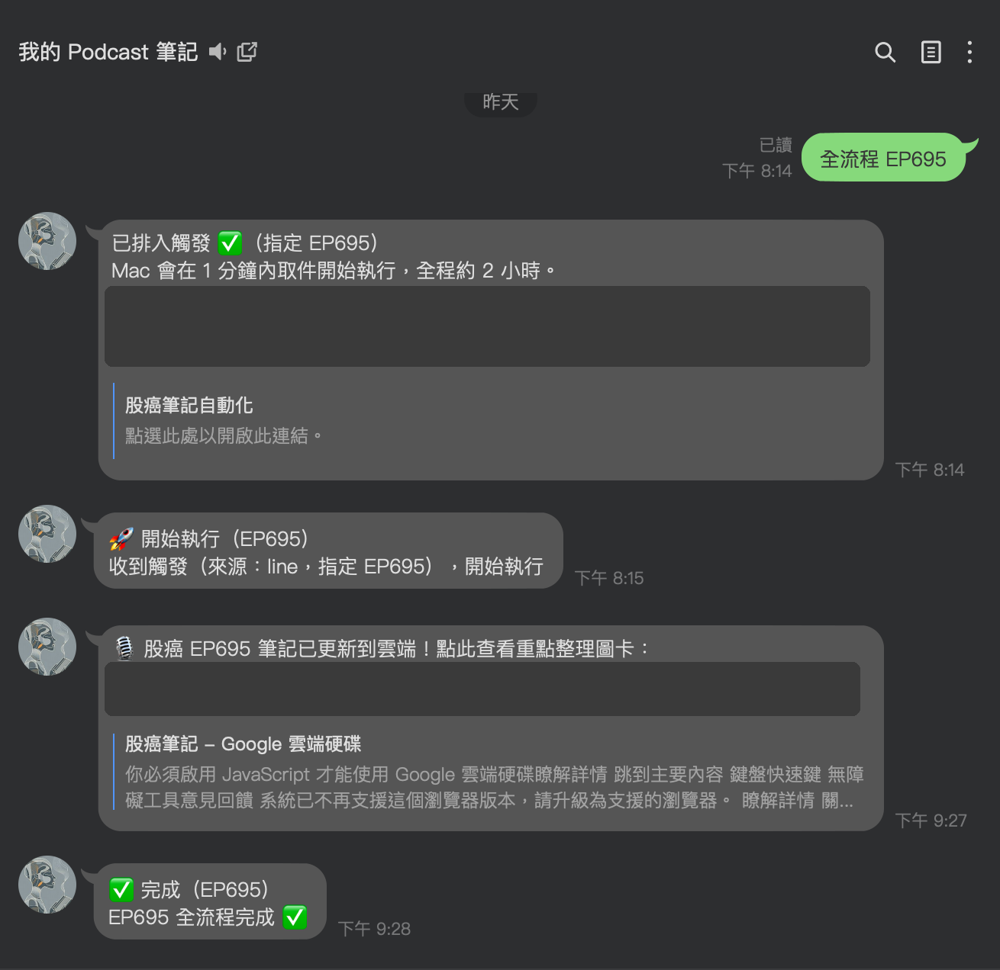
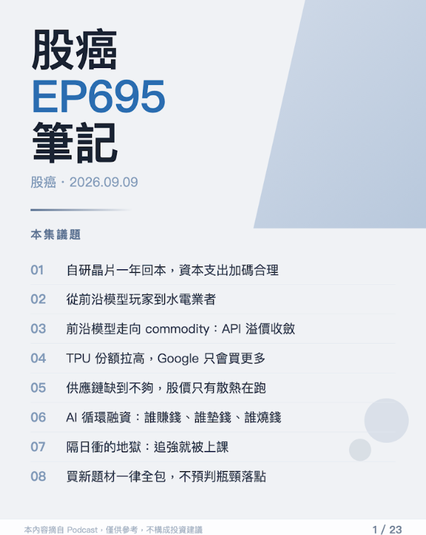

## 問題背景

常聽的 Podcast 每集一到兩小時，重點散落在對話裡。想留下筆記，就得邊聽邊記、聽完再整理——每集要花上一到兩小時。成本高到「幾乎不會去做」，知識就這樣流掉，筆記債越積越多。

這正是我最常對客戶說的那種流程：重複、耗時、每一步都不需要人的判斷——只是還沒有人把它串起來。

## 解決方案

把整條路串成無人值守的 pipeline，人的動作只剩下「在 LINE 傳一則訊息」：

```
LINE 訊息 → GAS 觸發佇列 → macOS 輪詢 agent → RSS 下載音檔
→ 本地 Whisper 轉錄 → LLM 校稿與摘要 → HTML 卡片回送 LINE
```

在 LINE 對話框輸入想處理的集數，Google Apps Script 把任務寫進佇列；家裡的 macOS 上有一個輪詢 agent，領到任務後從節目 RSS 下載音檔、呼叫本地 Whisper 轉錄、交給 LLM 校稿與產出結構化摘要，最後把成品排版成 HTML 卡片回送到 LINE。

傳完訊息就可以去做別的事，摘要卡片完成後自己出現在對話裡。



*實際的 LINE 對話：一則「全流程 EP695」訊息，系統依序回報排入觸發、開始執行、筆記更新到雲端、全流程完成。*



*成品的摘要卡片封面（單集共 20+ 張圖卡）：議題目錄、逐題重點整理，完成後自動送回 LINE。*

## 我的角色與做法

- **獨立完成端到端**：從需求（自己的痛）、架構設計、開發到維運，一人交付，目前已穩定處理約 50 集。
- **可靠性設計**：鎖檔互斥避免同一任務重複執行、心跳回寫讓佇列端知道 agent 還活著、機器休眠錯過排程時能在喚醒後 30 分鐘內自動補觸發。
- **成本設計**：轉錄呼叫自建的離線轉錄工具（見[影片轉錄與摘要工具](/projects/video-notes)），完全本地執行——零 API 轉錄費用、無流量限制，音檔也不出本機。

## 技術決策

**佇列放在 Google Apps Script，重活留給本機。** LINE Webhook 需要一個 24 小時在線的接收端，但轉錄這種重運算不值得為它租伺服器。GAS 免費、常駐、跟試算表天生整合，剛好當任務佇列與狀態板；macOS 端只需要一個輪詢 agent，有任務才開工。

**轉錄不走雲端 API。** 復用自建的 faster-whisper CLI 工具：一次性建置換來零邊際成本，處理 50 集的轉錄費用是 0 元。LLM 只負責校稿與摘要——輸入是文字而非音訊，token 成本低一個數量級。

## 挑戰與踩坑

最難的不是轉錄，是「無人值守」這四個字。

機器會休眠、排程會錯過、任務會重複觸發、網路會斷在下載到一半。前幾集幾乎每一種都遇過：同一集被轉錄兩次、agent 睡死沒人發現、佇列狀態跟實際進度對不上。

解法是把 pipeline 當正式系統對待：每個任務有明確的狀態機、agent 定期心跳回寫、開工前先搶鎖、喚醒後檢查有沒有錯過的排程要補跑。這些可靠性設計不是一開始就有的，是每踩一個坑補一塊——也是這個專案跟「寫一支跑得動的腳本」差距最大的地方。
