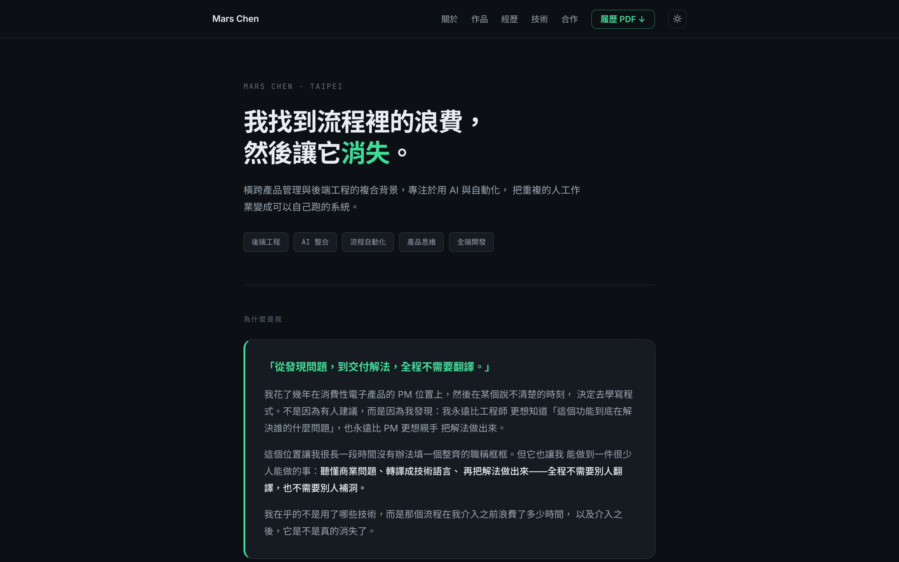

## 問題背景

求職和接案需要的是兩種說服：前者看工程能力與協作方式，後者看「你能不能聽懂我的問題、把它解掉」。模板作品集（Linktree、Notion 頁、佈景主題）只能放專案連結和一句話介紹，呈現不出從發現問題到交付解法的過程——而那個過程才是複合背景真正的賣點。

所以這個網站的需求從第一天就很明確：**以 case study 為中心**，每個作品講清楚問題、思路、做法、結果，而不是堆技術名詞。

## 解決方案

- **內容架構**：作品是 Astro Content Collections 管理的 Markdown，frontmatter 有 Zod schema 驗證——欄位缺漏在 build 時就會報錯，不會上線後才發現
- **設計系統**：冷白底 × 墨綠主色的自訂 token 系統，深色模式換成深炭底 × 亮綠（同色相的亮色版），所有元件走 CSS 變數，不用任何現成佈景
- **卡片敘事**：首頁作品卡展開後是「Before／Think／After」三段式，先講問題與思路，技術標籤放最後
- **部署自動化**：push 到 master 即觸發 GitHub Actions build + 部署到 GitHub Pages，約 40 秒上線，零維運成本
- **內容後台**：Decap CMS（git-based）——網頁介面編輯作品與上傳圖片，儲存即 commit，不需要開編輯器

*首頁：定位句先於技術名詞，作品卡片以「問題」開場。*

## 我的角色與做法

- **一人全包，但按正式專案的流程走**：需求定義（兩種受眾）、競品分析（參考同類工程師作品集的架構取捨）、設計規格文件、實作、驗證、部署，每個階段都有產出物。
- **驗證不靠感覺**：每次改版用瀏覽器自動化逐頁截圖檢查版面，手機版導覽列爆版就是靠實際量測（需要 445px、視窗只有 390px）抓出來的，不是等人回報。
- **隱私當作交付標準**：截圖上站前逐張檢查——LINE 對話裡的 webhook 網址打碼、儀表板數字換成等比縮放的展示資料、含員工與客戶名稱的素材直接不用。

## 技術決策

**選 Astro 而不是 Next.js**：這是內容型靜態網站，沒有動態資料、沒有使用者狀態。Astro 預設零 JavaScript、build 快、部署到 GitHub Pages 零成本零維運；Next.js + 資料庫的組合對這個需求是過度工程。需求不同，選型就不同——這正是我想在每個 case study 裡展示的判斷。

**後台選 git-based CMS 而不是資料庫**：GitHub Pages 不支援伺服器端渲染，換掉它意味著多一個要維護的平台。Decap CMS 直接以 git 為儲存層：後台的每次儲存就是一個 commit，內容有版本紀錄、可以 diff、可以回滾，而且不需要任何伺服器。

**成效數字放 frontmatter 不放正文**：`metric` 欄位由版型統一渲染成大字，強迫每個作品先回答「成效是什麼」，寫不出來的作品就還不到能上站的程度——schema 即紀律。

## 挑戰與踩坑

**框架新版的 API 變動**：Astro 6 改了 Content Collections 的多個 API（`render(entry)` 匯入方式、slug 改為 `id`、設定檔路徑），網路上多數教學還是舊版寫法。解法是以官方 migration 文件為準、把踩過的差異記進專案文件，讓之後的開發不再踩一次。

**「沒有後台」的取捨**：靜態站改內容要動 Markdown + git，對非工程情境不友善。評估過三個方案——git-based CMS、換平台上 SSR + 資料庫、整站改寫——最後選擇動最小的那個：保留架構，只加一層 git-based 後台。改動最小、可逆性最高，這個判斷方式跟我對客戶專案的建議標準是同一套。
