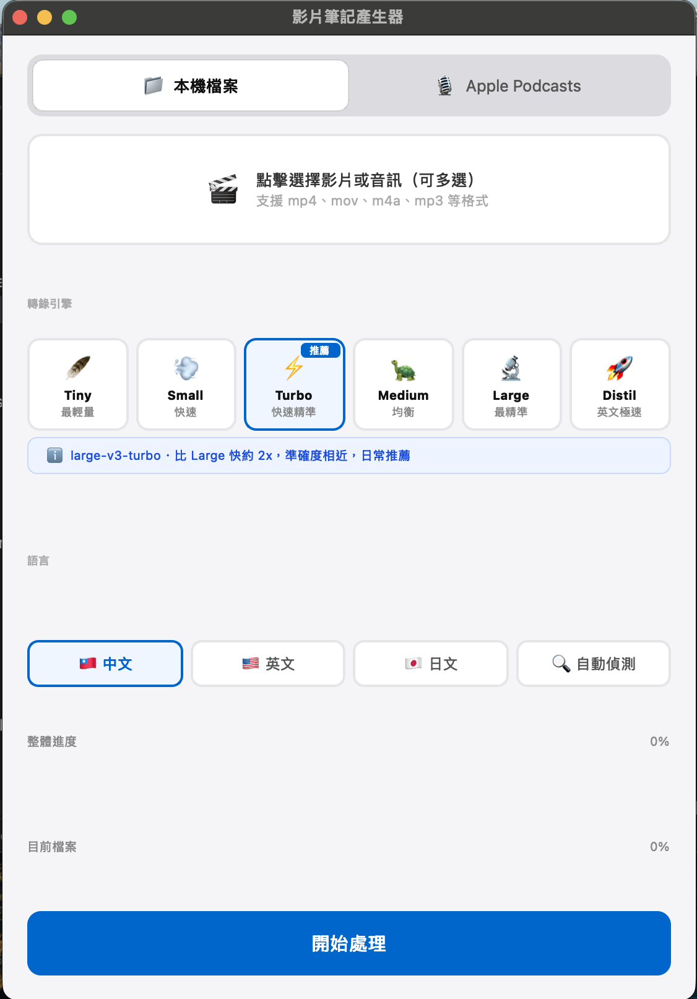

## 問題背景

大量線上課程和 Podcast 只有影音，沒有任何文字整理。想複習某個知識點，只能重新播放影片在腦中重建內容。想快速掌握一集 Podcast 的重點，卻沒時間完整聽完。

市面上的轉錄工具，中文輸出多以簡體為主，對繁體中文使用者閱讀體驗很差；想手動整理逐字稿，又太耗時。

## 解決方案

開發了一套本地執行的影片轉錄工具，支援 CLI 和 GUI 兩種操作方式。把影片檔案拖進去，工具自動完成：用 FFmpeg 提取音訊、用 faster-whisper 在本機跑語音辨識、用 OpenCC 把辨識結果轉換成繁體中文。

輸出兩份檔案：`.srt` 字幕檔可以直接掛回影片播放器，`_notes.md` 是帶時間戳記的結構化 Markdown 筆記，可以在任何 Markdown 編輯器裡閱讀或搜尋。macOS 版包裝成 `.app`，雙擊就能開啟，不需要開終端機：



*選擇轉錄引擎與語言，按「開始處理」即可。支援本機檔案與 Apple Podcasts 兩種來源。*

```bash
# 單一影片
python -m video_notes lecture.mp4

# 批次處理整個課程資料夾
python -m video_notes ./lectures/
```

## 技術決策

謄稿是「人做沒有價值、機器做完全可以」的典型工作。

核心決策是選用 `faster-whisper` 而不是 OpenAI 的原版 Whisper：同樣的模型權重、速度快四倍、中文辨識準確率相近。更重要的是完全本地執行，不需要 API 金鑰、不需要網路連線、沒有 API 費用，也不需要把語音資料傳到外部伺服器——對醫療相關課程來說，資料隱私是不能妥協的考量。

加入 OpenCC 這一層轉換是針對繁體中文使用者的明確設計。Whisper 的中文輸出以簡體為主，對台灣使用者來說閱讀體驗很差。OpenCC 後處理讓輸出直接是可讀的繁體中文，不需要使用者再手動轉換。

## 挑戰與踩坑

遇到兩個主要問題。

第一，長影片（超過一小時）在本機跑完整轉錄需要較長時間，使用體驗很差。解法是切分成多段批次處理再合併，讓使用者可以看到進度，也方便在較低規格的硬體上執行。

第二，專業術語的辨識準確率偏低——藥物學名、儀器品牌名這類詞彙，語音辨識模型經常辨識錯誤。目前採人工校對方式處理，工具說明裡有明確標示，使用者使用前就知道專業術語需要校對。這是已知的限制，而不是隱藏的缺陷。
